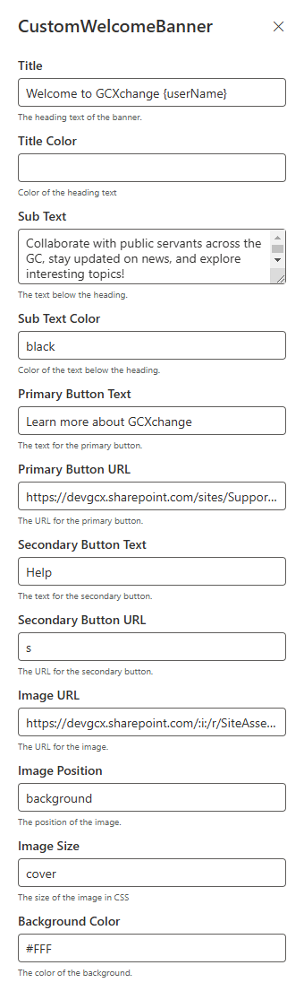

# Welcome Banner

## Summary

- The webpart pulls the current user's name and can displays it in the title with `{userName}`.
- It contains a clickable primary button that redirects to another page.
- It contains a secondary secondary button that redirects to another page.
- The link URL for the buttons can be entered in the property pane.
- Welcome message displays in between greeting text and the button.
- The greeting text, welcome message, and text on the button are customizable through the property pane.
- The image for the banner can be configured in the property pane. It expects a url.
- The image position can be configured in the property pane.
- The background color of the banner can also be configured in the property pane.
- The layout of the banner can he either `aside` or `background`. 
- Since everything is customizable through the property pane, it can be used in any language and doesn't require being rebuild and uploaded to the app catalogue.
- Webpart can be placed in full-width column layouts. 

### Webpart:

### Settings / Property Pane:

## Prerequisites
None
## API permission
None
## Version 

## Applies to

- [SharePoint Framework](https://aka.ms/spfx)
- [Microsoft 365 tenant](https://docs.microsoft.com/en-us/sharepoint/dev/spfx/set-up-your-developer-tenant)

> Get your own free development tenant by subscribing to [Microsoft 365 developer program](http://aka.ms/o365devprogram)

## Version history

| Version | Date         | Comments                |
| ------- | ------------ | ----------------------- |
| 1.0     | Jul 29, 2022 | Initial release         |
| 1.1     | Jan 10, 2024 | Upgraded to SPFX 1.17.4 |

## Minimal Path to Awesome

- Clone this repository
- Ensure that you are at the solution folder
- In the command-line run:
  - **npm install**
  - **gulp serve**
- You will need to add your client id and azure function to the `clientId` and `url` classs members at the top of the filename.tsx file.
- To debug in the front end:
  - go to the `serve.json` file and update `initialPage` to `https://domain-name.sharepoint.com/_layouts/15/workbench.aspx`
  - Run the command **gulp serve**
- To deploy: in the command-line run
  - **gulp bundle --ship**
  - **gulp package-solution --ship**
- Add the webpart to your tenant app store
- Add the Webpart to a page
- Edit the webpart
  - Enter the Greeting, Welcome Message and Text for Button in required language in the property pane (setting)
  - Enter the URL for button in the property pane (setting)
- Save and publish the page

## Disclaimer

**THIS CODE IS PROVIDED *AS IS* WITHOUT WARRANTY OF ANY KIND, EITHER EXPRESS OR IMPLIED, INCLUDING ANY IMPLIED WARRANTIES OF FITNESS FOR A PARTICULAR PURPOSE, MERCHANTABILITY, OR NON-INFRINGEMENT.**